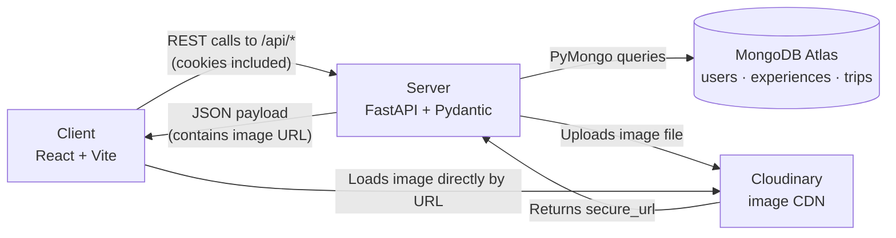
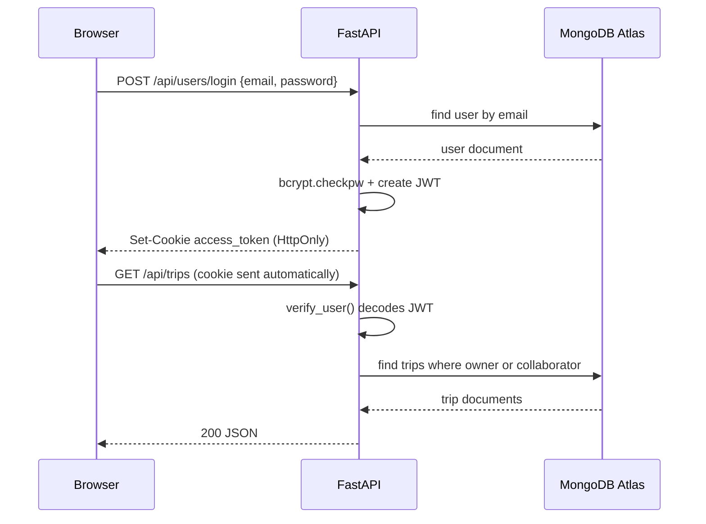
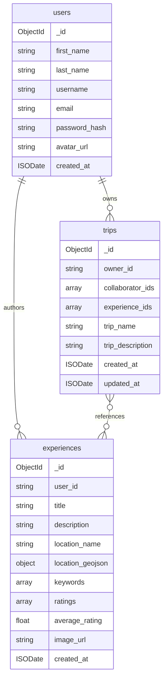

# Crowd-Sourced Travel Planner

A platform where travelers create, discover, and rate experiences (events, restaurants, festivals, sightseeing) and group them into personalized trip itineraries.

**Live Application:** https://travelplanner-129337949325.us-central1.run.app/home

**API Documentation (Swagger UI):** https://travelplanner-129337949325.us-central1.run.app/docs

> CS 467 Capstone: Oregon State University, Summer 2026
> Allison Langlois, Kevin Lin, Michael Valderrama, and Sean Miller

---

## Table of Contents

- [Features](#features)
- [Tech Stack](#tech-stack)
- [Architecture](#architecture)
- [Project Structure](#project-structure)
- [Getting Started](#getting-started)
- [Environment Variables](#environment-variables)
- [Running the Application](#running-the-application)
- [Database Schema](#database-schema)
- [Authentication](#authentication)
- [Image Storage (Cloudinary)](#image-storage-cloudinary)
- [API Reference](#api-reference)
- [Testing](#testing)
- [Deployment](#deployment)
- [Contributing](#contributing)
- [Team](#team)

---

## Features

- **Accounts**: register, log in, edit your profile, upload an avatar, change your password, delete your account
- **Experiences**: create, edit, and delete travel experiences with a title, description, location, keywords, and a photo
- **Search**: filter experiences by location name and/or keyword, with pagination and sorting
- **Ratings**: rate other users' experiences 1–5; the average updates automatically (you can't rate your own)
- **Trips**: create named itineraries, add and remove experiences, and share a trip with collaborators
- **Image hosting**: photos are stored on Cloudinary, keeping the database lightweight

---

## Tech Stack

| Layer | Technology |
| --- | --- |
| Frontend | React 19, React Router 7, Vite 8 |
| Backend | Python 3.13, FastAPI, Uvicorn, Pydantic v2 |
| Database | MongoDB Atlas (via PyMongo) |
| Authentication | JWT (`python-jose`) in HTTP-only cookies, bcrypt password hashing |
| Media storage | Cloudinary |
| Testing | pytest, mongomock, httpx |
| Deployment | Docker, Google Cloud Build, Google Cloud Run |
| Tooling | Git/GitHub, ESLint, Swagger UI, Mermaid |

---

## Architecture

The application is split into four isolated layers so each can be developed, debugged, and hosted independently.



**How the layers connect**

1. **Client -> Server.** The React app calls relative paths under `/api`. In development, the Vite dev server (port `9000`) proxies `/api` to the FastAPI server on port `8000`, so the browser only ever sees one origin. In production, FastAPI serves the compiled React bundle from its own `static/` directory, so frontend and backend share an origin there too. Same-origin in both environments is what lets the auth cookie work without CORS complications.
2. **Server -> Database.** `src/config.py` opens a single `MongoClient` on startup (FastAPI `lifespan`) and exposes `config.db`. Routes read and write the `users`, `experiences`, and `trips` collections directly; Pydantic schemas validate every incoming payload before it reaches Mongo.
3. **Server -> Cloudinary.** Image uploads are sent to the backend as `multipart/form-data`, validated (type and size), forwarded to Cloudinary, and only the returned `secure_url` string is stored in MongoDB.
4. **Client -> Cloudinary.** The browser loads images straight from the Cloudinary CDN using the stored URL. Those requests never touch our server.

**Request lifecycle for a protected route**



---

## Project Structure

```
Crowd-Sourced-Travel-Planner/
├── backend/
│   ├── src/
│   │   ├── main.py               # App entry point, CORS, router registration, static file serving
│   │   ├── config.py             # MongoDB + Cloudinary connection lifecycle
│   │   ├── routes/               # API endpoints
│   │   │   ├── users.py          # /api/users
│   │   │   ├── experiences.py    # /api/experiences
│   │   │   └── trips.py          # /api/trips
│   │   ├── schemas/              # Pydantic request/response models
│   │   │   ├── users.py
│   │   │   ├── experiences.py
│   │   │   └── trips.py
│   │   └── utility/
│   │       ├── authentication.py # Password hashing, JWT creation, verify_user dependency
│   │       ├── mongodb.py        # ObjectId <-> string helpers
│   │       └── cloudinary.py     # Upload helper with type/size validation
│   ├── tests/                    # pytest suite (mongomock, no live DB required)
│   ├── requirements.txt
│   ├── requirements-dev.txt      # Adds pytest, mongomock, httpx
│   ├── pytest.ini
│   └── .env.example
├── frontend/
│   ├── src/
│   │   ├── App.jsx               # React Router route definitions
│   │   ├── main.jsx              # React DOM entry point
│   │   ├── pages/                # Login, Registration, HomePage, Experiences, Trips, Profile, ...
│   │   ├── components/           # Header, Sidebar, ExperienceCard, TripCard
│   │   ├── layouts/              # Shared page shells
│   │   ├── helpers/              # ProtectedRoutes, getInitials
│   │   ├── services/api.js       # Centralized fetch wrapper for all API calls
│   │   └── styles/               # Per-feature CSS
│   ├── vite.config.js            # Dev server port 9000 + /api proxy to port 8000
│   └── package.json
├── scripts/start-backend.js      # Launches uvicorn using the backend venv
├── Dockerfile                    # Multi-stage: build React, serve from FastAPI
├── cloudbuild.yaml               # Google Cloud Build -> Cloud Run pipeline
└── package.json                  # Root: runs frontend + backend concurrently
```

---

## Getting Started

### Prerequisites

- **Python 3.13+**
- **Node.js 20+** and npm
- A **MongoDB Atlas** cluster (free tier is fine) with a connection string
- A **Cloudinary** account (free tier is fine) for cloud name, API key, and API secret

### 1. Clone the repository

```bash
git clone https://github.com/travel-project-team/Crowd-Sourced-Travel-Planner.git
cd Crowd-Sourced-Travel-Planner
```

### 2. Set up the backend

```bash
cd backend
python -m venv venv

# Windows
.\venv\Scripts\activate
# macOS / Linux
source venv/bin/activate

pip install -r requirements.txt      # add -r requirements-dev.txt to run tests
```

### 3. Configure environment variables

```bash
cp .env.example .env      # Windows: copy .env.example .env
```

Then fill in `backend/.env` (see the table below).

### 4. Install frontend and root dependencies

```bash
cd ../frontend
npm install

cd ..
npm install
```

---

## Environment Variables

All backend configuration lives in `backend/.env`, which is git-ignored. Never commit real credentials.

| Variable | Description | Where to find it |
| --- | --- | --- |
| `MONGODB_URL` | MongoDB Atlas connection string. The app uses the `travel_planner` database. | Atlas -> Cluster -> Connect -> Drivers |
| `SECRET_KEY` | Secret used to sign JWT access tokens (HS256). Use a long random string. | Generate with `python -c "import secrets; print(secrets.token_hex(32))"` |
| `CLOUDINARY_NAME` | Cloudinary cloud name | Cloudinary dashboard |
| `CLOUDINARY_KEY` | Cloudinary API key | Cloudinary dashboard |
| `CLOUDINARY_SECRET` | Cloudinary API secret | Cloudinary dashboard |

In production these are set as Cloud Run environment variables (or secrets) rather than a `.env` file.

---

## Running the Application

From the **repository root**, with the backend venv created:

```bash
npm run start
```

This runs both servers concurrently:

| Service | URL |
| --- | --- |
| Frontend (Vite) | http://localhost:9000 |
| Backend (FastAPI) | http://localhost:8000 |
| Swagger UI | http://localhost:8000/docs |

Open **http://localhost:9000**. Requests to `/api/*` are proxied to the backend automatically.

**To run services individually**

```bash
# Backend only 
npm run dev:backend

# Frontend only
npm run dev:frontend
```

---

## Database Schema

MongoDB database: `travel_planner`. Three collections, linked by `ObjectId` strings.



### `users`

| Field | Type | Notes |
| --- | --- | --- |
| `_id` | ObjectId | Serialized to a string for the client |
| `first_name`, `last_name`, `username` | String | Required at registration |
| `email` | String | Unique; validated by Pydantic `EmailStr`; used as the login identifier |
| `password_hash` | String | bcrypt hash. The plaintext password is never stored or returned |
| `avatar_url` | String \| null | Cloudinary URL |
| `created_at` | ISODate | UTC |

### `experiences`

| Field | Type | Notes |
| --- | --- | --- |
| `_id` | ObjectId | Serialized to a string for the client |
| `user_id` | String | Author's user `_id`; set server-side from the auth cookie |
| `title` | String | Required |
| `description` | String \| null | Free-text detail; searched alongside `title` and `keywords` |
| `location_name` | String | Required; searched with a case-insensitive regex |
| `location_geojson` | Object \| null | `{ "type": "Point", "coordinates": [lng, lat] }` |
| `keywords` | Array\<String\> | Searched alongside title and description |
| `ratings` | Array\<Int\> | Individual 1–5 scores |
| `average_rating` | Float \| null | Recomputed on each new rating |
| `image_url` | String \| null | Cloudinary `secure_url` |
| `created_at` | ISODate | UTC |

### `trips`

| Field | Type | Notes |
| --- | --- | --- |
| `_id` | ObjectId | Serialized to a string for the client |
| `owner_id` | String | Set server-side from the auth cookie |
| `collaborator_ids` | Array\<String\> | Users granted shared access |
| `experience_ids` | Array\<String\> | Maintained with `$addToSet` / `$pull` so updates are atomic and duplicate-free |
| `trip_name` | String | Required |
| `trip_description` | String \| null | Free-text summary of the itinerary |
| `created_at`, `updated_at` | ISODate | `updated_at` is refreshed on every write |

**Trip permission model (two tiers)**

| Action | Owner | Collaborator | Anyone else |
| --- | --- | --- | --- |
| View trip | Yes | Yes | No |
| Edit trip details | Yes | Yes | No |
| Add/remove experiences | Yes | Yes | No |
| Delete trip | Yes | No | No |

Experiences are public to read, but only the author may edit or delete one, and authors cannot rate their own.

---

## Authentication

- Passwords are hashed with **bcrypt** on registration and verified on login. Hashes never leave the server.
- On successful login the server issues a **JWT** (HS256, signed with `SECRET_KEY`, 60-minute expiry) containing the user's email (`sub`) and `user_id`.
- The token is returned in an **HTTP-only cookie** named `access_token`. It is not readable by JavaScript, which protects against XSS token theft. The browser attaches it automatically to same-origin requests, so the frontend never handles the token directly.
- Protected routes depend on `verify_user`, which decodes the cookie, looks up the user, and injects the user document into the handler. Failures return `401`.
- `POST /api/users/logout` clears the cookie.

---

## Image Storage (Cloudinary)

1. The client sends a file to `POST /api/experiences/image` (or `/api/users/avatar`) as `multipart/form-data`.
2. `src/utility/cloudinary.py` validates the MIME type (**JPEG, PNG, WEBP only**) and size (**5 MB max**), then uploads to the `travel_planner` folder with `fetch_format: auto` and `quality: auto` transformations.
3. Cloudinary returns a `secure_url`; only that string is written to MongoDB.
4. The browser loads the image from the Cloudinary CDN, bypassing our server entirely.

The upload runs in a thread executor so the blocking Cloudinary SDK call doesn't stall the async event loop.

---

## API Reference

Base path: `/api`. Interactive docs are available at `/docs` (Swagger UI) when the server is running.
The **Auth** column indicates whether the endpoint requires a valid `access_token` cookie.

### Users: `/api/users`

| Method | Endpoint | Auth | Description |
| --- | --- | --- | --- |
| `POST` | `/api/users` | No | Register a new account |
| `POST` | `/api/users/login` | No | Log in; sets the `access_token` cookie |
| `POST` | `/api/users/logout` | No | Clear the auth cookie |
| `GET` | `/api/users` | Yes | Get the current user's profile |
| `PUT` | `/api/users` | Yes | Update name, username, or email |
| `PUT` | `/api/users/password` | Yes | Change password (requires `current_password`) |
| `DELETE` | `/api/users` | Yes | Delete the account |
| `POST` | `/api/users/id` | Yes | Batch-fetch profiles by user IDs |
| `POST` | `/api/users/email` | Yes | Batch-fetch profiles by email (used to add collaborators) |
| `POST` | `/api/users/avatar` | Yes | Upload a profile image |
| `DELETE` | `/api/users/avatar` | Yes | Remove the profile image |

### Experiences: `/api/experiences`

| Method | Endpoint | Auth | Description |
| --- | --- | --- | --- |
| `GET` | `/api/experiences` | No | List and search experiences |
| `GET` | `/api/experiences/user` | Yes | List the current user's experiences |
| `GET` | `/api/experiences/{id}` | No | Get one experience |
| `POST` | `/api/experiences` | Yes | Create an experience |
| `PUT` | `/api/experiences/{id}` | Yes | Update (author only) |
| `DELETE` | `/api/experiences/{id}` | Yes | Delete (author only) |
| `POST` | `/api/experiences/image` | Yes | Upload an image, returns `{ image_url }` |
| `POST` | `/api/experiences/{id}/ratings` | Yes | Submit a 1–5 rating (not your own experience) |

**Search query parameters** on `GET /api/experiences`:

| Parameter | Default | Description |
| --- | --- | --- |
| `location` | None | Case-insensitive partial match on `location_name` |
| `keyword` | None | Case-insensitive match across `keywords`, `title`, and `description` |
| `limit` | `50` | 1–100 results per page |
| `skip` | `0` | Offset for pagination |
| `sort` | `created_at` | One of `created_at`, `title`, `average_rating` |
| `order` | `desc` | `asc` or `desc` |

The response includes an **`X-Total-Count`** header with the total number of matches before pagination, so the client can build page controls.

### Trips: `/api/trips`

| Method | Endpoint | Auth | Description |
| --- | --- | --- | --- |
| `GET` | `/api/trips` | Yes | List trips you own or collaborate on (`limit`, `skip`, `sort`, `order`) |
| `GET` | `/api/trips/{id}` | Yes | Get one trip |
| `POST` | `/api/trips` | Yes | Create a trip |
| `PUT` | `/api/trips/{id}` | Yes | Update trip details or collaborators |
| `DELETE` | `/api/trips/{id}` | Yes | Delete a trip (owner only) |
| `POST` | `/api/trips/{id}/experiences/{experience_id}` | Yes | Add an experience to a trip |
| `DELETE` | `/api/trips/{id}/experiences/{experience_id}` | Yes | Remove an experience from a trip |

---

## Testing

The backend suite uses **mongomock**, so no live database connection is needed.

```bash
cd backend
source venv/bin/activate            # Windows: .\venv\Scripts\activate
pip install -r requirements-dev.txt
pytest
```

Coverage includes registration and login flows, cookie handling on logout, ownership and collaborator permission checks, password-change validation, and CRUD behavior for experiences and trips.

---

## Deployment

The app is deployed to **Google Cloud Run** as a single container that serves both the API and the compiled React bundle.

**How the container is built** (`Dockerfile`, multi-stage):

1. **Stage 1**: `node:20` installs frontend dependencies and runs `npm run build`, producing `frontend/dist`.
2. **Stage 2**: `python:3.13-slim` installs the backend requirements, copies `backend/`, and copies the built frontend into `backend/static`.
3. At runtime `src/main.py` detects `static/`, mounts `/assets`, and serves `index.html` for any unmatched path so client-side routing works on refresh.
4. Uvicorn listens on port `8080`, which Cloud Run expects.

**Continuous deployment** (`cloudbuild.yaml`) builds the image, pushes it to Google Container Registry tagged with the commit SHA, and deploys it to the `travelplanner` Cloud Run service in `us-central1`.

**Manual deploy:**

```bash
gcloud builds submit --config cloudbuild.yaml
```

Set `MONGODB_URL`, `SECRET_KEY`, and the three Cloudinary variables as Cloud Run environment variables, and allow-list Cloud Run's egress in MongoDB Atlas Network Access.

---

## Contributing

Work happens on feature branches; `main` stays deployable.

**Branch naming:** lowercase with hyphens, prefixed by your name: `yourname/feature-name` (e.g. `kevin/login-registration`).

```bash
# 1. Start from an up-to-date main
git switch main
git pull

# 2. Create your branch
git switch -c yourname/feature-name

# 3. Commit your work
git add .
git commit -m "Short description of the change"

# 4. Push
git push origin yourname/feature-name

# 5. Open a pull request on GitHub
```

Every pull request needs **one approving review** from a teammate before it can be merged into `main`.

---

## Team

| Name | Focus |
| --- | --- |
| Allison Langlois | Frontend |
| Kevin Lin | Backend |
| Michael Valderrama | Backend |
| Sean Miller | Frontend |
